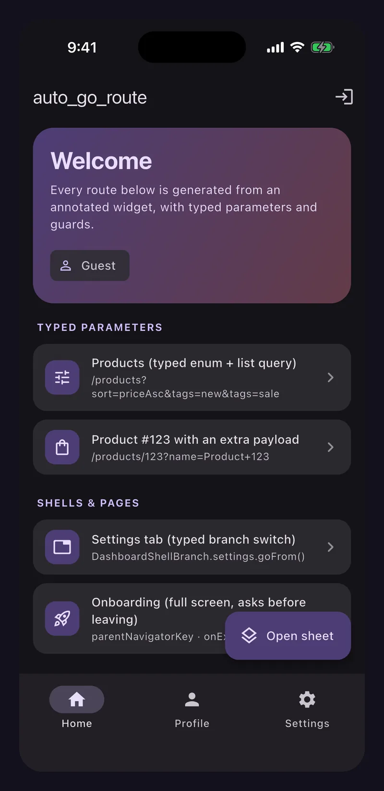
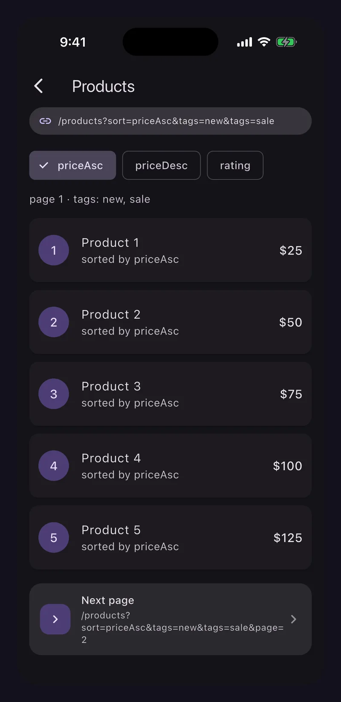
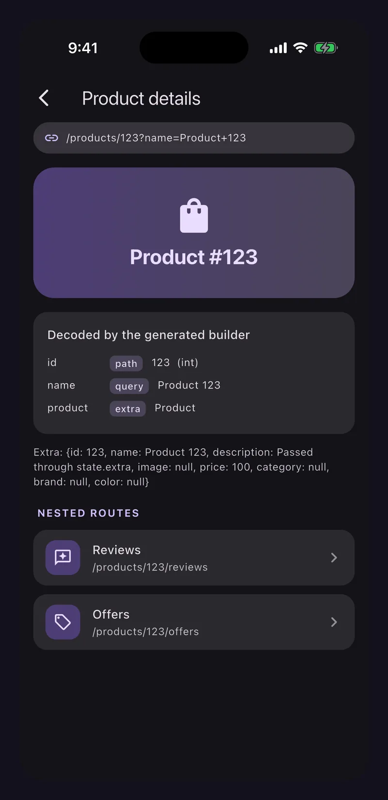
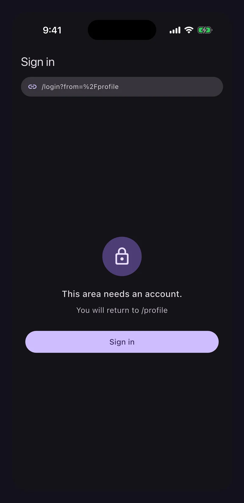
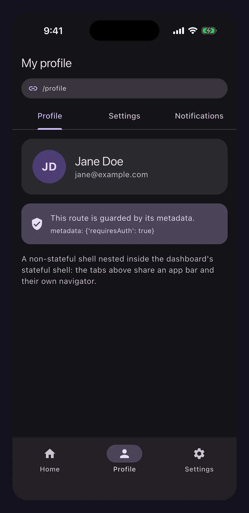
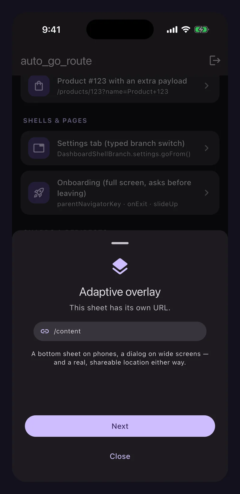

# auto_go_route

[](https://pub.dev/packages/auto_go_route)
[](https://pub.dev/packages/auto_go_route_generator)
[](https://github.com/itsarvinddev/auto_go_route/actions/workflows/ci.yaml)
[](https://pub.dev/packages/auto_go_route/score)
[](LICENSE)

**Type-safe, code-generated routing for Flutter, built on `go_router`.**

Annotate your screens. The generator writes the `go_router` route table, typed
URL builders and typed navigation helpers — so a wrong parameter is a compile
error, not a blank screen in production.

```dart
@AutoGoRoute(path: '/products/:id')
class ProductPage extends StatelessWidget {
  const ProductPage({super.key, required this.id, this.tab});

  final int id;        // path parameter, decoded as an int
  final String? tab;   // query parameter, ?tab=
}

context.goToProductPage(id: 42, tab: 'reviews');   // → /products/42?tab=reviews
```


---

## Contents

- [Highlights](#highlights)
- [Screenshots](#screenshots)
- [Why auto_go_route](#why-auto_go_route)
- [Compatibility](#compatibility)
- [Getting started](#getting-started)
- **Guides** — [Parameters](#parameters) · [Nesting](#nesting) · [Shells](#shells) · [Guards](#guards) · [Transitions and pages](#transitions-and-pages) · [Dynamic routing](#dynamic-routing)
- **Reference** — [Generated API](#generated-api) · [go_router parity](#go_router-parity) · [Introspection](#introspection) · [Build configuration](#build-configuration)
- [Using with AI assistants](#using-with-ai-assistants)
- [Troubleshooting](#troubleshooting)
- [Example app](#example-app) · [Contributing](#contributing) · [License](#license)

## Highlights

- **Routes live on the widget.** No hand-maintained route table to drift out of
  sync with your screens.
- **Typed parameters end to end.** `int`, `double`, `bool`, `DateTime`, `Uri`,
  `BigInt`, enums and lists are encoded into the URL and decoded back for you.
- **Generated navigation helpers.** `goTo…`, `pushTo…<T>`, `replaceWith…`,
  `replaceInPlaceWith…` and `locationOf…` for every route.
- **Every `go_router` feature.** Stateful and stateless shells, branch
  preloading, `redirect`, `onEnter`, `onExit`, `metadata`, observers,
  restoration, custom pages and dynamic `RoutingConfig`.
- **Errors at build time.** Missing imports, unreachable parameters, duplicate
  names and invalid shells fail the build with a message that says how to fix
  them.
- **Every platform.** Android, iOS, web, macOS, Windows and Linux.
- **AI-ready.** Ships an [`llms.txt`](llms.txt) brief and
  [copy-paste prompts](#using-with-ai-assistants) for coding assistants.

## Screenshots

Captured from the [example app](example) — every screen is reached through a
generated helper, and the bar at the top shows the real URL.

<table>
  <tr>
    <td align="center" width="33%"><br><sub><b>Generated routes</b><br>Stateful shell with bottom navigation</sub></td>
    <td align="center" width="33%"><br><sub><b>Typed queries</b><br><code>?sort=priceAsc&amp;tags=new&amp;tags=sale</code></sub></td>
    <td align="center" width="33%"><br><sub><b>Path, query and extra</b><br>Decoded by the generated builder</sub></td>
  </tr>
  <tr>
    <td align="center"><br><sub><b>Guards</b><br>Metadata-driven redirect to <code>/login?from=…</code></sub></td>
    <td align="center"><br><sub><b>Nested shells</b><br>A shell inside a stateful branch</sub></td>
    <td align="center"><br><sub><b>Adaptive overlays</b><br>A bottom sheet with a real URL</sub></td>
  </tr>
</table>

## Why auto_go_route

`go_router` is Flutter's recommended router, and this package does not replace
it. It removes the boilerplate around it and makes the URL layer type-safe.

| | Plain `go_router` | `auto_go_route` |
|---|---|---|
| Route table | Written by hand, kept in sync by hand | Generated from the widgets |
| Path parameters | `state.pathParameters['id']!` — a `String`, checked at runtime | `final int id;` — typed, checked at compile time |
| Navigating | `context.go('/products/$id')` | `context.goToProductPage(id: 42)` |
| Renaming a path | Search and replace | Change one annotation |
| Forgetting a parameter | A 404 or a blank screen | A compile error |
| `go_router` features | All of them | All of them — see [parity](#go_router-parity) |

## Compatibility

| `auto_go_route` | `go_router` | Flutter | Dart |
|---|---|---|---|
| **2.0.x** | `>=17.5.0 <19.0.0` | `>=3.38.1` | `>=3.10.0` |
| 1.1.x | `^16.2.4` | `>=3.29.0` | `>=3.7.0` |

> [!IMPORTANT]
> **2.0.0 is a breaking release.** Follow **[MIGRATION.md](MIGRATION.md)** to
> upgrade from 1.x. If a 1.x build hangs or fails with
> `Missing implementation of visitDotShorthandPropertyAccess`, that is
> [issue #3](https://github.com/itsarvinddev/auto_go_route/issues/3), and
> upgrading fixes it.

## Getting started

### 1. Install

```yaml
dependencies:
  auto_go_route: ^2.0.0

dev_dependencies:
  auto_go_route_generator: ^2.0.0
  build_runner: ^2.16.1
```

```bash
flutter pub get
```

`auto_go_route` re-exports `go_router`. You do not need a separate `go_router`
dependency or import for `GoRouter`, `GoRouterState` or `context.go`.

### 2. Annotate a screen

The widget *is* the route definition.

```dart
// lib/pages/home_page.dart
import 'package:auto_go_route/auto_go_route.dart';
import 'package:flutter/material.dart';

@AutoGoRoute(path: '/home', description: 'The landing screen.')
class HomePage extends StatelessWidget {
  const HomePage({super.key});

  @override
  Widget build(BuildContext context) =>
      const Scaffold(body: Center(child: Text('Home')));
}
```

### 3. Create the router library

The generated file is a `part` of this library, so **everything the generated
code refers to must be imported here**: every annotated widget, the types of
their parameters, and any guard, navigator key or page builder an annotation
names. Flutter and `go_router` types are already covered by
`package:auto_go_route/auto_go_route.dart`.

```dart
// lib/app_router.dart
import 'package:auto_go_route/auto_go_route.dart';

import 'pages/home_page.dart';        // every annotated widget
import 'pages/product_page.dart';

part 'app_router.routes.g.dart';      // note the `.routes.g.dart` suffix

@AutoGoRouteBase(initialLocation: '/home')
class AppRouter extends _$AppRouter {}
```

Forget an import and the build fails with a list of the missing names, instead
of leaving an `Undefined name` error inside a generated file.

### 4. Generate

```bash
dart run build_runner build
```

Use `dart run build_runner watch` to regenerate on every save.

### 5. Wire it up

Build the router once, outside any `build` method:

```dart
// lib/main.dart
final appRouter = AppRouter();
final router = appRouter.buildRouter();

void main() => runApp(MaterialApp.router(routerConfig: router));
```

`buildRouter()` accepts every `GoRouter` option as a named argument, each
defaulting to the annotation. Pass runtime objects — which cannot appear in an
annotation — here:

```dart
final router = appRouter.buildRouter(
  refreshListenable: authService,
  debugLogDiagnostics: kDebugMode,
  observers: [analyticsObserver],
);
```

### 6. Navigate

```dart
context.goToHomePage();
context.pushToProductPage(id: 42, tab: 'reviews');
context.replaceWithProductPage(id: 43);

// The URL without navigating — for links, share sheets and tests.
final url = context.locationOfProductPage(id: 42);   // '/products/42'
```

## Parameters

Each constructor parameter is classified in this order:

1. `key`, and a shell's child slot (its `Widget` or `StatefulNavigationShell`
   parameter), are skipped.
2. An explicit `@PathParam`, `@QueryParam`, `@RouteExtra` or `@RouteIgnore`
   wins. It can go on the field or on the parameter.
3. A name that appears in the route's **resolved** path is a path parameter.
4. A URL-representable type is a query parameter.
5. Anything else is read from `state.extra`.

A required parameter with no possible source is a build error, never a silently
empty value.

### Supported types

`String`, `int`, `double`, `num`, `bool`, `BigInt`, `DateTime`, `Uri` and any
`enum`, nullable or not. `List<T>` of those is supported for **query**
parameters as a repeated key.

```dart
enum Sort { priceAsc, priceDesc, rating }

@AutoGoRoute(path: '/products')
class ProductList extends StatelessWidget {
  const ProductList({
    super.key,
    this.sort = Sort.rating,   // ?sort=priceAsc — the default applies when absent
    this.tags,                 // ?tags=new&tags=sale
    this.page = 1,             // ?page=2
    this.since,                // ?since=2026-01-01T00:00:00.000Z
  });

  final Sort sort;
  final List<String>? tags;
  final int page;
  final DateTime? since;
  // ...
}

context.goToProductList(sort: Sort.priceAsc, tags: const ['new'], page: 2);
// → /products?sort=priceAsc&tags=new&page=2
```

### Renaming a parameter on the wire

```dart
@AutoGoRoute(path: '/home')
class HomePage extends StatelessWidget {
  const HomePage({super.key, this.featureDisabled});

  // `feature-disabled` is not a valid Dart identifier.
  @QueryParam('feature-disabled')
  final bool? featureDisabled;
}
```

### Objects in `extra`

A parameter whose type cannot be written into a URL is read from `state.extra`.
A route has one `extra`, so two such parameters is a build error.

```dart
@AutoGoRoute(path: '/products/:id')
class ProductPage extends StatelessWidget {
  const ProductPage({super.key, required this.id, this.product});

  final int id;
  final Product? product;   // from state.extra
}

context.pushToProductPage(id: 42, extra: product);
```

> [!TIP]
> Make `extra` parameters **nullable**. `extra` is lost on deep links, browser
> reloads and state restoration, so a non-nullable one will throw the first
> time someone opens a shared URL.

### Regular-expression constraints

```dart
@AutoGoRoute(path: r'/users/:id(\d+)')   // digits only
class UserPage extends StatelessWidget {
  const UserPage({super.key, required this.id});
  final int id;
}
```

### Optional path parameters

`go_router` does not support them, so `:id?` is a build error. Use a nullable
query parameter or declare two routes — see
[MIGRATION.md](MIGRATION.md#5-optional-path-parameters-are-rejected).

<details>
<summary><b>Handling malformed URLs</b></summary>

A value the URL cannot hold — `/products/abc` for an `int id` — throws
`RouteParamFormatException`, naming the parameter, the expected type and the
raw value. It is thrown while the page builds, so it does not reach
`GoRouter.onException`, which only sees routing failures.

To send a malformed link somewhere useful, check it in a route `redirect`,
where `RouteCodec` reads parameters the same way:

```dart
FutureOr<String?> validId(BuildContext context, GoRouterState state) {
  try {
    return RouteCodec.optionalInt(state, 'id') == null ? '/not-found' : null;
  } on FormatException {
    return '/not-found';
  }
}

@AutoGoRoute(path: '/products/:id', redirect: 'validId')
class ProductPage extends StatelessWidget { /* ... */ }
```

</details>

## Nesting

Give a route a `parent` and keep its path relative. Path parameters from the
parent are inherited.

```dart
@AutoGoRoute(path: '/products/:id')
class ProductPage extends StatelessWidget { /* ... */ }

@AutoGoRoute(path: 'reviews', parent: ProductPage)
class ReviewsPage extends StatelessWidget {
  const ReviewsPage({super.key, required this.id});
  final int id;   // inherited from /products/:id
}

// → /products/:id/reviews
context.goToReviewsPage(id: 42);
```

## Shells

> [!NOTE]
> A `go_router` shell contributes no URL segment. A shell's children keep their
> own paths: a child declared as `/general` is reachable at `/general`, not
> `/settings-area/general`.

### Bottom navigation (stateful shell)

Each child becomes a `StatefulShellBranch` with its own navigator, so each tab
keeps its state. `order` sets the branch — and tab — index.

```dart
@AutoGoRouteShell(path: '/', isStateful: true)
class DashboardShell extends StatelessWidget {
  const DashboardShell({super.key, required this.navigationShell});

  final StatefulNavigationShell navigationShell;

  @override
  Widget build(BuildContext context) => Scaffold(
    body: navigationShell,
    bottomNavigationBar: NavigationBar(
      selectedIndex: navigationShell.currentIndex,
      onDestinationSelected: (index) {
        final branch = DashboardShellBranch.values[index];
        // Tapping the active tab again returns it to its first screen.
        branch.go(navigationShell, initialLocation: branch.isActiveIn(navigationShell));
      },
      destinations: const [/* ... */],
    ),
  );
}

@AutoGoRoute(path: '/feed', parent: DashboardShell, order: 0)
@AutoGoRouteBranch(preload: true)   // build this branch eagerly
class FeedPage extends StatelessWidget { /* ... */ }

@AutoGoRoute(path: '/inbox', parent: DashboardShell, order: 1)
class InboxPage extends StatelessWidget { /* ... */ }
```

Every stateful shell gets a generated **branch enum**, built from the same
`order` values as the branches, so tab indexes can never drift:

```dart
DashboardShellBranch.inboxPage.goFrom(context);   // from any screen inside the shell
DashboardShellBranch.of(navigationShell);         // the active branch
DashboardShellBranch.feedPage.initialLocation;    // '/feed'
```

Things to know:

- A shell at `/` gets a generated redirect from `/` to its first branch, unless
  you declare a real route at `/`.
- A stateful shell has no navigator of its own, so `navigatorKey` and
  `observers` go on `@AutoGoRouteBranch`. Setting them on the shell is a build
  error.
- A branch whose first route has path parameters needs
  `@AutoGoRouteBranch(initialLocation: ...)`, since go_router cannot derive one.

### Shared chrome (stateless shell)

A plain shell takes a `Widget child`:

```dart
@AutoGoRouteShell(path: '/settings-area', initialRoute: '/general')
class SettingsShell extends StatelessWidget {
  const SettingsShell({super.key, required this.child});
  final Widget child;
  // ...
}

@AutoGoRoute(path: '/general', parent: SettingsShell)
class GeneralSettingsPage extends StatelessWidget { /* ... */ }
```

A shell's own path redirects to `initialRoute`, or, when that is omitted, to
its first child without path parameters. No redirect is generated over a real
route at the same path.

### Bottom sheets and dialogs with real URLs

`AdaptiveOverlayPage` presents a shell's children as a bottom sheet on phones
and a centred dialog on wide screens, while keeping the URL shareable:

```dart
Page<dynamic> sheetPageBuilder(
  BuildContext context,
  GoRouterState state,
  Widget child,
) => AdaptiveOverlayPage(child: child, heightFactor: 0.9);

@AutoGoRouteShell(path: '/compose', pageBuilder: 'sheetPageBuilder')
class ComposeShell extends StatelessWidget {
  const ComposeShell({super.key, required this.child});
  final Widget child;

  @override
  Widget build(BuildContext context) => child;
}
```

## Guards

Annotations refer to functions **by name, as strings**. The functions must be
top-level or static and visible from the router library.

### Route-level guards

```dart
FutureOr<String?> requireAuth(BuildContext context, GoRouterState state) =>
    authService.isLoggedIn ? null : '/login';

@AutoGoRoute(path: '/profile', middleware: ['requireAuth'])
class ProfilePage extends StatelessWidget { /* ... */ }
```

A route's `redirect:` runs first, then each `middleware` entry in order. The
first non-null result wins.

### Metadata-driven guards (recommended)

Attach data to routes and write a single guard, so protecting a new route is a
one-line change:

```dart
@AutoGoRoute(path: '/admin', metadata: {'requiresRole': 'admin'})
class AdminPage extends StatelessWidget { /* ... */ }

FutureOr<String?> appRedirect(BuildContext context, GoRouterState state) {
  final role = state.metadataAs<String>('requiresRole');
  if (role != null && authService.role != role) return '/home';
  return null;
}

@AutoGoRouteBase(redirect: 'appRedirect')
class AppRouter extends _$AppRouter {}

// Re-run redirects whenever the auth state changes.
final router = AppRouter().buildRouter(refreshListenable: authService);
```

### Confirming before leaving

```dart
Future<bool> confirmDiscard(BuildContext context, GoRouterState state) async =>
    await showDialog<bool>(context: context, builder: /* ... */) ?? false;

@AutoGoRoute(path: '/compose', onExit: 'confirmDiscard')
class ComposePage extends StatelessWidget { /* ... */ }
```

### Intercepting every navigation

`@AutoGoRouteBase(onEnter: 'appOnEnter')` maps to `GoRouter.onEnter`, which
runs before any navigation and returns `Allow()` or `Block.stop()`.

## Transitions and pages

```dart
@AutoGoRoute(
  path: '/sheet',
  transition: AutoRouteTransition.slideUp,
  transitionDurationMs: 250,
  opaque: false,
  barrierDismissible: true,
)
class SheetPage extends StatelessWidget { /* ... */ }
```

`AutoRouteTransition` offers `platform` (the default), `material`, `cupertino`,
`fade`, `slide`, `slideUp`, `slideDown`, `scale`, `rotation` and `none`. For
anything else, set `pageBuilder:` to the name of a
`Page<dynamic> Function(BuildContext, GoRouterState)`. `buildAutoRoutePage()` is
public, so a custom page builder can reuse the built-in transitions.

### Full-screen routes over a shell

A route on the root navigator covers the bottom navigation bar. Declare the key
on `@AutoGoRouteBase` too, so it is also the router's navigator key, as
`go_router` requires:

```dart
final rootNavigatorKey = GlobalKey<NavigatorState>();

@AutoGoRoute(path: '/onboarding', parentNavigatorKey: 'rootNavigatorKey')
class OnboardingPage extends StatelessWidget { /* ... */ }

@AutoGoRouteBase(navigatorKey: 'rootNavigatorKey')
class AppRouter extends _$AppRouter {}
```

## Dynamic routing

`GoRouter.routingConfig` lets the available routes change at runtime — routes
that only exist after sign-in, or a feature flag that removes a section —
without rebuilding the router or losing navigation state:

```dart
final routingConfig = ValueNotifier(appRouter.buildRoutingConfig());
final router = appRouter.buildDynamicRouter(routingConfig: routingConfig);

// Later — the router picks the change up immediately.
routingConfig.value = appRouter.buildRoutingConfig(
  routes: [...appRouter.routes, ...featureRoutes],
  redirect: flagRedirect,
);
```

`buildRoutingConfig` defaults `routes`, `redirect`, `onEnter` and
`redirectLimit` to the annotation; `buildDynamicRouter` defaults every other
option, exactly like `buildRouter`.

## Generated API

For each route the generator emits a definition class and five navigation
helpers:

```dart
class ProductPageRoute extends RoutePaths {
  static const String routeName = 'productPage';
  static const String routeTemplate = '/products/:id';

  String pathWith({required int id, String? tab, /* ... */});
}

extension AutoGoRouteNavigation on BuildContext {
  String locationOfProductPage({required int id, /* ... */});
  void goToProductPage({required int id, /* ... */});
  Future<T?> pushToProductPage<T extends Object?>({required int id, /* ... */});
  void replaceWithProductPage({required int id, /* ... */});         // pushReplacement
  void replaceInPlaceWithProductPage({required int id, /* ... */});  // replace
}
```

Every helper also accepts `queries`, `fragment` and `extra`. The route name
defaults to the widget class name in lowerCamelCase; override it with
`@AutoGoRoute(name: ...)`.

On the router base:

```dart
appRouter.routes;                 // List<RouteBase> — compose it yourself
appRouter.allRoutes;              // every RoutePaths definition
appRouter.allShells;              // every ShellRoutePaths definition
appRouter.productPageRoute;       // one cached definition per route
appRouter.buildRouter(/* ... */);
appRouter.buildRoutingConfig();   // RoutingConfig, for dynamic routing
appRouter.buildDynamicRouter(routingConfig: /* ... */);

AppRoute.values;                  // an enum of every route, with name + template
DashboardShellBranch.values;      // one enum per stateful shell, in tab order
```

Rename the extension with `@AutoGoRouteBase(navigatorExtensionName: 'AppNav')`,
or turn the enums off with `generateRouteEnum: false`.

## go_router parity

Every `go_router` 17.5+ feature is available through an annotation, a
`buildRouter()` argument, or the generated `routes` list.

<details>
<summary><b>Show the full mapping</b></summary>

| `go_router` | How to reach it |
|---|---|
| `GoRoute.builder` | The annotated widget |
| `GoRoute.pageBuilder` | `pageBuilder:` or `transition:` |
| `GoRoute.redirect` | `redirect:`, `middleware:` |
| `GoRoute.onExit` | `onExit:` |
| `GoRoute.parentNavigatorKey` | `parentNavigatorKey:` |
| `GoRoute.caseSensitive` | `caseSensitive:` (also a router-wide default) |
| `GoRoute.metadata` | `metadata:`, read with `state.metadataAs<T>()` |
| `GoRoute.routes` | `parent:` |
| `ShellRoute` | `@AutoGoRouteShell` |
| `ShellRoute.navigatorKey` / `observers` / `restorationScopeId` | Same names on `@AutoGoRouteShell` (for a stateful shell, `navigatorKey` and `observers` go on `@AutoGoRouteBranch`) |
| `ShellRouteBase.notifyRootObserver` | `notifyRootObserver:` |
| `StatefulShellRoute.indexedStack` | `@AutoGoRouteShell(isStateful: true)` |
| `StatefulShellRoute` with a custom layout | `navigatorContainerBuilder:` |
| `StatefulShellBranch` (`navigatorKey`, `initialLocation`, `observers`, `restorationScopeId`, `preload`) | `@AutoGoRouteBranch` on the child |
| `StatefulNavigationShell.goBranch` | The generated `<Shell>Branch` enum's `go` / `goFrom` |
| `GoRouter.onEnter` | `onEnter:` |
| `GoRouter.onException` | `onException:` |
| `GoRouter.errorBuilder` / `errorPageBuilder` | `errorBuilder:` / `errorPageBuilder:` / `errorWidget:` |
| `GoRouter.redirect` / `redirectLimit` | `redirect:` / `redirectLimit:` |
| `GoRouter.refreshListenable` | `refreshListenable:`, or `buildRouter()` |
| `GoRouter.observers` / `navigatorKey` / `restorationScopeId` | Same names, or `buildRouter()` |
| `GoRouter.extraCodec` | `extraCodec:` |
| `GoRouter.initialLocation` / `initialExtra` | Same names |
| `GoRouter.routerNeglect` / `requestFocus` / `overridePlatformDefaultLocation` / `debugLogDiagnostics` | Same names, or `buildRouter()` |
| `GoRouter.routingConfig` / `RoutingConfig` | `buildDynamicRouter()` / `buildRoutingConfig()` |
| `CustomTransitionPage` / `NoTransitionPage` | `transition:`, or `buildAutoRoutePage()` |
| Anything else | `go_router` is re-exported and `appRouter.routes` is public — build the `GoRouter` yourself |

</details>

## Introspection

`RouteRegistry` indexes route definitions for validation, documentation and
debug screens:

```dart
final registry = RouteRegistry.scoped()..registerAll(appRouter.allRoutes);

registry.validateAllRoutes();
registry.findClosest('/prodcuts');     // → the /products route
print(registry.generateDocumentation(format: DocumentationFormat.markdown));
```

## Build configuration

<details>
<summary><b>More than one router in a package</b></summary>

Each `@AutoGoRouteBase` scans the whole package by default, so two routers
would both contain every route and declare the same public classes. Scope each
one — the build warns until you do:

```dart
@AutoGoRouteBase(sourceGlobs: ['lib/admin/**/*.dart'])
class AdminRouter extends _$AdminRouter {}
```

A router library outside `lib/`, under `test/` for example, also scans its own
top-level directory.

</details>

<details>
<summary><b>Narrowing the scan on large packages</b></summary>

```yaml
# build.yaml
targets:
  $default:
    builders:
      auto_go_route_generator:auto_go_route_builder:
        options:
          source_globs:
            - lib/features/**/*.dart
            - lib/app_router.dart
```

</details>

## Using with AI assistants

`auto_go_route` ships **[`llms.txt`](llms.txt)**: a compact, authoritative
brief written for AI coding assistants. It covers setup, the rules an assistant
must follow, parameter classification, the generated API, shells, guards and
common build errors. It is kept in step with each release, so it takes
precedence over older examples an assistant may have learned from.

### Give your assistant the brief

Pick whichever fits your tools:

- **Paste a URL.** Assistants that can browse can read it directly:
  `https://raw.githubusercontent.com/itsarvinddev/auto_go_route/main/llms.txt`
- **Read it from the installed package.** `llms.txt` is included in the
  published package. Agents with file access can find the package's `rootUri`
  in `.dart_tool/package_config.json` and read `llms.txt` there — it always
  matches the version you installed.
- **Vendor it into your repository** and reference it from your assistant's
  project instructions (`AGENTS.md`, `CLAUDE.md`, `.github/copilot-instructions.md`,
  `.cursor/rules/`, and so on):

  ```bash
  curl -o docs/auto_go_route.llms.txt https://raw.githubusercontent.com/itsarvinddev/auto_go_route/main/llms.txt
  ```

  ```markdown
  ## Routing
  This app routes with auto_go_route. Before changing navigation, read
  docs/auto_go_route.llms.txt and follow its rules. Never edit *.routes.g.dart
  files; change the annotations and run `dart run build_runner build`.
  ```

### Copy-paste prompts

Each prompt is self-contained. Replace the text in `<angle brackets>`.

<details open>
<summary><b>1. Add auto_go_route to a Flutter app</b></summary>

```text
Set up type-safe routing in this Flutter app with auto_go_route 2.x.

First read https://raw.githubusercontent.com/itsarvinddev/auto_go_route/main/llms.txt
and follow its rules exactly.

1. Add auto_go_route ^2.0.0 to dependencies, and auto_go_route_generator ^2.0.0
   and build_runner ^2.16.1 to dev_dependencies. Do not add go_router separately.
2. Annotate each screen widget with @AutoGoRoute. Turn the data each screen needs
   into typed constructor parameters: IDs in the path, filters and options as
   query parameters, and at most one nullable object per route in extra.
3. Create lib/app_router.dart with `part 'app_router.routes.g.dart';`, an
   @AutoGoRouteBase class, and imports for every annotated widget and every type
   their parameters use.
4. Build the router once in main.dart with AppRouter().buildRouter() and pass it
   to MaterialApp.router.
5. Run `dart run build_runner build`, then `flutter analyze`, and fix every
   issue by changing annotations or imports — never the generated file.
6. Replace string-based navigation with the generated context.goTo…/pushTo…
   helpers.

Screens: <list your screens, their paths and the data each one needs>
```

</details>

<details>
<summary><b>2. Convert an existing go_router configuration</b></summary>

```text
Migrate this app's hand-written go_router configuration to auto_go_route 2.x
without changing any URL or behaviour.

Read https://raw.githubusercontent.com/itsarvinddev/auto_go_route/main/llms.txt
first and follow its rules.

- Find the GoRouter setup (<path to the router file>). For every GoRoute, add
  @AutoGoRoute to the widget it builds, keeping the same path and name. Nested
  GoRoutes become `parent:` with a relative path.
- Replace manual reads of state.pathParameters, state.uri.queryParameters and
  state.extra with typed constructor parameters. Keep the existing wire names
  with @PathParam / @QueryParam where they differ from the Dart names.
- ShellRoute becomes @AutoGoRouteShell; StatefulShellRoute becomes
  @AutoGoRouteShell(isStateful: true), with branch options on
  @AutoGoRouteBranch and the child's `order:` matching its current tab index.
- Route redirects become `redirect:` or `middleware:` naming top-level
  functions; router-level options move to @AutoGoRouteBase, and runtime objects
  such as refreshListenable are passed to buildRouter().
- Replace context.go('/path/$id') and context.push(...) calls with the generated
  helpers.
- Run `dart run build_runner build`, `flutter analyze` and `flutter test`.
  Finish with a table mapping every old path to its new route class.
```

</details>

<details>
<summary><b>3. Upgrade from auto_go_route 1.x to 2.0</b></summary>

```text
Upgrade this project from auto_go_route 1.x to 2.0.

Read the migration guide first:
https://raw.githubusercontent.com/itsarvinddev/auto_go_route/main/MIGRATION.md
and the assistant brief:
https://raw.githubusercontent.com/itsarvinddev/auto_go_route/main/llms.txt

1. Bump auto_go_route and auto_go_route_generator to ^2.0.0 and build_runner to
   ^2.16.1, as described in section 1. Remove any direct go_router dependency
   unless other code needs it.
2. Run `dart run build_runner build` and fix every build error by following the
   fix included in its message.
3. Work through each other MIGRATION.md section that applies to this project —
   for example typed navigation call sites, buildRouter, optional path
   parameters, parameter sources and error handlers.
4. Run `flutter analyze` and `flutter test`, and replace deprecated APIs with
   the replacements named in their deprecation messages.
5. Summarise each change and link the MIGRATION.md section that required it.
```

</details>

<details>
<summary><b>4. Add a new screen</b></summary>

```text
Add a new screen using auto_go_route. Follow the rules in llms.txt
(https://raw.githubusercontent.com/itsarvinddev/auto_go_route/main/llms.txt).

- Screen: <ScreenName>
- Path: <for example /orders/:orderId>
- Parent route or shell: <none, or the parent widget class>
- Data it needs: <for example orderId (int, path), status (OrderStatus enum,
  optional query), order (Order object, optional extra)>

Create the widget with @AutoGoRoute and typed constructor parameters, import it
in the router library, run `dart run build_runner build`, and navigate to it
from <existing screen> with the generated goTo… helper. Do not edit generated
files or build URLs by hand.
```

</details>

<details>
<summary><b>5. Protect routes with a guard</b></summary>

```text
Add authentication guards with auto_go_route, following llms.txt
(https://raw.githubusercontent.com/itsarvinddev/auto_go_route/main/llms.txt).

- Mark protected routes with `metadata: {'requiresAuth': true}` on their
  @AutoGoRoute annotations: <list the routes>.
- Write one top-level `FutureOr<String?> appRedirect(BuildContext context,
  GoRouterState state)` in the router library. It reads
  state.metadataAs<bool>('requiresAuth') and redirects signed-out users to
  /login?from=<the original location, URI-encoded>.
- Register it with @AutoGoRouteBase(redirect: 'appRedirect').
- Pass the auth state as buildRouter(refreshListenable: ...) so redirects
  re-run on sign-in and sign-out.
- After sign-in, return the user to the `from` location.
- Add widget tests for the signed-out redirect and the return after sign-in.
```

</details>

<details>
<summary><b>6. Add bottom navigation</b></summary>

```text
Add bottom navigation with preserved tab state using auto_go_route, following
llms.txt (https://raw.githubusercontent.com/itsarvinddev/auto_go_route/main/llms.txt).

- Create a shell widget annotated @AutoGoRouteShell(path: '/', isStateful: true)
  that takes a StatefulNavigationShell and renders a NavigationBar.
- Tabs, in order: <for example Home /home, Search /search, Account /account>.
  Give each tab's root screen `parent: <ShellName>` and `order: <index>`.
- Switch tabs with the generated <ShellName>Branch enum — never raw indexes —
  and reset a tab when its active destination is tapped again.
- Screens that must cover the navigation bar use
  parentNavigatorKey: 'rootNavigatorKey', with
  @AutoGoRouteBase(navigatorKey: 'rootNavigatorKey').
- Run build_runner and add a widget test that switches tabs and checks that each
  tab keeps its state.
```

</details>

<details>
<summary><b>7. Fix a build or runtime error</b></summary>

```text
My auto_go_route build or navigation is failing. Using the rules and the
troubleshooting section in
https://raw.githubusercontent.com/itsarvinddev/auto_go_route/main/llms.txt,
find the root cause and fix it in the annotations, imports or router library —
never in *.routes.g.dart. Then run `dart run build_runner build` and
`flutter analyze` to confirm the fix.

auto_go_route version: <from pubspec.lock>
Flutter version: <flutter --version>
Error output:
<paste the full error>
```

</details>

### Reviewing AI-generated routing code

Before accepting a change, check that it:

- [ ] declares routes with annotations and does not edit `*.routes.g.dart`;
- [ ] names guards, keys and builders as **strings** that are imported into the router library;
- [ ] navigates with generated helpers instead of string paths;
- [ ] keeps `extra` parameters nullable, with at most one per route;
- [ ] does not use `:param?` optional path segments;
- [ ] builds the router once, outside `build()`;
- [ ] passes `dart run build_runner build`, `flutter analyze` and `flutter test`.

## Troubleshooting

<details>
<summary><b>The build hangs, or fails with <code>Missing implementation of visitDotShorthandPropertyAccess</code></b></summary>

A 1.x generator pinned `analyzer: ^7`, which cannot parse Dart 3.10+ syntax.
Upgrade to `auto_go_route_generator: ^2.0.0`
([issue #3](https://github.com/itsarvinddev/auto_go_route/issues/3)).

</details>

<details>
<summary><b><code>A member named 'pushNamed' is defined in ... and neither is more specific</code></b></summary>

A 1.x extension collided with `go_router`'s own. Upgrade to 2.0, which removes
that method.

</details>

<details>
<summary><b><code>Undefined name</code> inside the generated file</b></summary>

Something an annotation names by string is not visible from the router library.
2.0 detects this at build time and lists the missing names. If you still see
it, the identifier is declared in a `part` that loads after the generated file.

</details>

<details>
<summary><b><code>build_runner</code> does not write the generated file</b></summary>

The `part` directive must be exactly `part '<your file>.routes.g.dart';`.

</details>

<details>
<summary><b>A route is missing from the generated table</b></summary>

The generator scans this package's `lib/` by default. Routes in a different
package are not discovered; move them, or widen `sourceGlobs` /
[`source_globs`](#build-configuration).

</details>

Still stuck? [Open an issue](https://github.com/itsarvinddev/auto_go_route/issues/new)
with your `auto_go_route` version, `flutter --version` and the full error.

## Example app

[`example/`](example) is a complete app that exercises every feature in this
README: a stateful shell with preloaded branches, a nested shell with its own
navigator, typed enum and list query parameters, a digits-only path constraint,
metadata-driven guards, an `onExit` confirmation, a full-screen route over the
shell, and an adaptive bottom-sheet flow. Its
[widget tests](example/test/widget_test.dart) drive the generated router end to
end.

```bash
cd example
flutter run
```

## Contributing

Issues and pull requests are welcome — see [CONTRIBUTING.md](CONTRIBUTING.md)
for the development workflow and the checks CI runs.

## License

MIT — see [LICENSE](LICENSE).

Made with ❤️ by [Arvind Sangwan](https://github.com/itsarvinddev) ·
[X](https://x.com/itsarvinddev)
