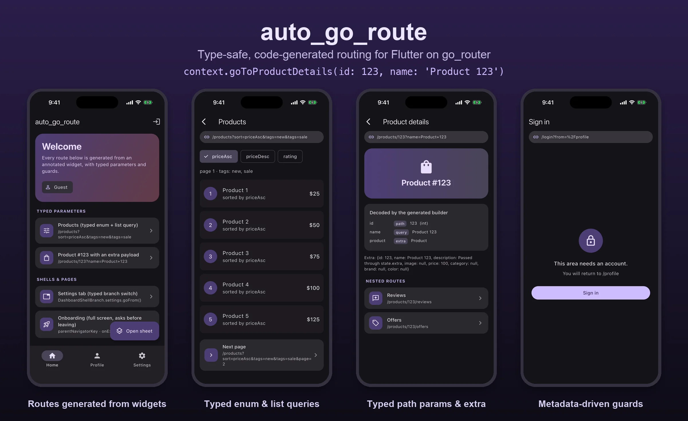

# auto_go_route example

A complete Flutter app exercising every feature of
[`auto_go_route`](https://pub.dev/packages/auto_go_route). It doubles as the
package's acceptance test suite — [`test/widget_test.dart`](test/widget_test.dart)
drives the *generated* router end to end, so a regression in the emitter shows
up as a failed navigation.



Every screen shows its real URL in a bar at the top, and the product details
screen lists each value the generated builder decoded, with its source (path,
query or extra).

```bash
flutter pub get
dart run build_runner build
flutter run
flutter test
```

## What is where

| File | Shows |
|---|---|
| [`lib/src/app_router.dart`](lib/src/app_router.dart) | the router library: `@AutoGoRouteBase`, navigator keys, guards, `onEnter`, observers — everything an annotation names by string has to live here |
| [`lib/main.dart`](lib/main.dart) | `buildRouter()` with runtime-only options (`refreshListenable`, `debugLogDiagnostics`) |
| [`lib/src/presentation/screens/dashboard_shell.dart`](lib/src/presentation/screens/dashboard_shell.dart) | a stateful shell driving a `NavigationBar` through the generated `DashboardShellBranch` enum; each child is a branch with its own navigator |
| [`lib/src/presentation/screens/home_screen.dart`](lib/src/presentation/screens/home_screen.dart) | `@AutoGoRouteBranch(preload: true)`, and `@QueryParam('feature-disabled')` renaming a non-identifier wire name |
| [`lib/src/presentation/screens/product_screens.dart`](lib/src/presentation/screens/product_screens.dart) | typed parameters: an `int` path parameter with a `:id(\d+)` constraint, an enum and a `List<String>` in the query string, a `Product` in `extra`, and two nested routes inheriting the parent's parameter |
| [`lib/src/presentation/screens/profile_screen.dart`](lib/src/presentation/screens/profile_screen.dart) | a nested non-stateful shell with its own `navigatorKey` and `initialRoute`, metadata-guarded tabs, a route-level `redirect`, and an enum query parameter with a default |
| [`lib/src/presentation/screens/settings_screen.dart`](lib/src/presentation/screens/settings_screen.dart) | a role guard written once against route `metadata` |
| [`lib/src/presentation/screens/onboarding_screen.dart`](lib/src/presentation/screens/onboarding_screen.dart) | `parentNavigatorKey` (full screen over the shell), `onExit` (confirm before leaving) and a slide-up transition |
| [`lib/src/presentation/screens/bottom_sheet.dart`](lib/src/presentation/screens/bottom_sheet.dart) | `AdaptiveOverlayPage` — a bottom sheet on phones, a dialog on desktop, with real shareable URLs |
| [`lib/src/presentation/screens/feature_screen.dart`](lib/src/presentation/screens/feature_screen.dart) | a `middleware:` guard behind a feature flag |
| [`lib/src/app_router.routes.g.dart`](lib/src/app_router.routes.g.dart) | the generated output, committed so the diff is reviewable |

## Try these URLs

The app is URL-first, so every state below is reachable by deep link — paste
one into the browser address bar on web, or pass `initialLocation`:

```
/                                            → redirects to /home-screen
/products?sort=priceAsc&tags=new&tags=sale&page=2
/products/123                                typed int path parameter
/products/abc                                rejected by :id(\d+)
/products/3/reviews                          nested, inherits :id
/profile                                     guarded: redirects to /login?from=…
/admin                                       needs the admin role
/notifications/N1/action?action=archive      nested + enum query parameter
/bottom-sheet                                redirects into the overlay flow
/onboarding?step=2                           full screen over the shell
```

## Signing in

There is no real auth. The Settings tab signs you in as `admin`; the header
button on Home toggles a plain user session. `refreshListenable` re-runs every
guard the moment that changes, which is why you are moved off a guarded route
immediately.
